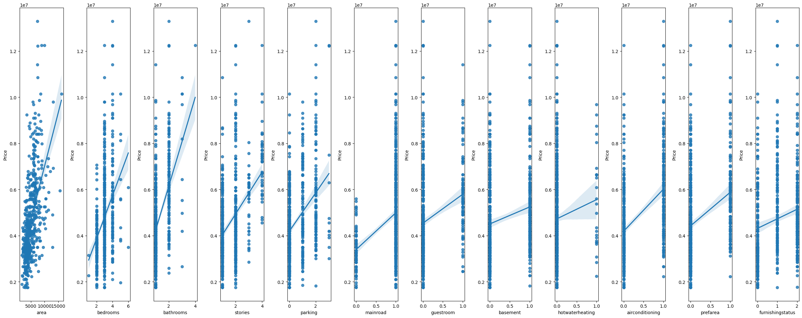

# House-price-prediction-using-linear-regression
In this project I built a linear regression algorithm from scratch to predict the price of the houses based on different features

# Preprocessing
In this project I did 3 steps of preprocessing:
## Step 1: Basic Information
1. **Data Types**:
   - Identify the data types present in the dataset (e.g., numerical, categorical, datetime).
2. **Range of Values**:
   - Explore the range of values for numerical columns (mean, max, count, etc.).
3. **Column Names**:
   - List of all column names present in the dataset.
4. **Null Values**:
   - Check for missing or null values in each column.
5. **Duplicate Values**:
   - Identify and handle any duplicate rows or observations.

## Step 2: Encoding Categorical Features
- Convert categorical features to numerical representation for machine learning purposes.

## Step 3: Extracting Insights for Feature Importance
- Perform analysis techniques to identify important features in the dataset.

# Goals
Building a fast, accurate and reliable linear regression model 

## Data
The detailed data was collected through https://www.kaggle.com/datasets/yasserh/housing-prices-dataset.
  The original dataset contained 545 records and 13 features including target value. After cleaning and eliminating unnecessary features, the number of records remained unchanged at 545, but the number of features decreased to 8.

These plots demonstrate a clear relationship between price (target value) and 12 other features. Among these features, the strongest correlations exist with area, bedrooms, bathrooms, parking, and stories. Conversely, weaker correlations are observed with guestroom, basement, hotwatering, and furnishing status. Consequently, removing these features with weaker correlations to price might potentially enhance the model accuracy and expedite gradient descent speed.

## Building the Model

## Conclusion
In conclusion, the provided visualizations and data present several key insights about airline flights and delays:

**Airline Count:** The list of airlines and their respective flight counts highlights that WN airline had the most flights among all the airlines, indicating their significant presence in the dataset.

**Day-Based Delays:** The plot illustrating delays based on days of the week indicates that the majority of flight delays occurred on Fridays. This information can be valuable for both airlines and passengers when planning their travel schedules.

**Heatmap Analysis:** The heatmap visualization, which examines flight delays across different airlines and days of the week, provides a comprehensive overview of how delays are distributed. It helps us understand that WN airline had the highest number of delays, particularly on Fridays. This insight can guide airline companies in identifying areas for improvement in their scheduling or operations.

**Delay Categories:** The plot that categorizes delays into three groups (under 5 minutes, 5-45 minutes, and over 45 minutes) for various airlines reveals that, regardless of the airline, long delays (over 45 minutes) constitute a relatively small portion of the delays. However, the distribution of delays in these categories varies between airlines, with some airlines experiencing a higher proportion of medium delays (5-45 minutes) compared to long delays.

These insights can be valuable for airlines and travelers alike. Airlines can use this information to optimize their operations and minimize delays, especially on Fridays. Passengers can make more informed decisions when planning their trips, potentially avoiding peak delay times and airlines with specific delay patterns.

